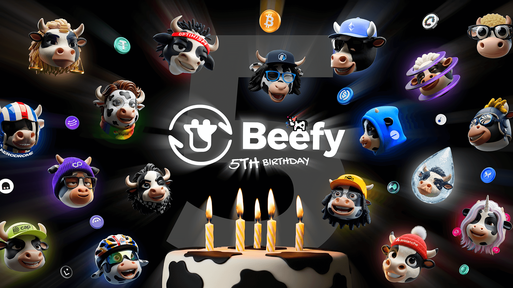
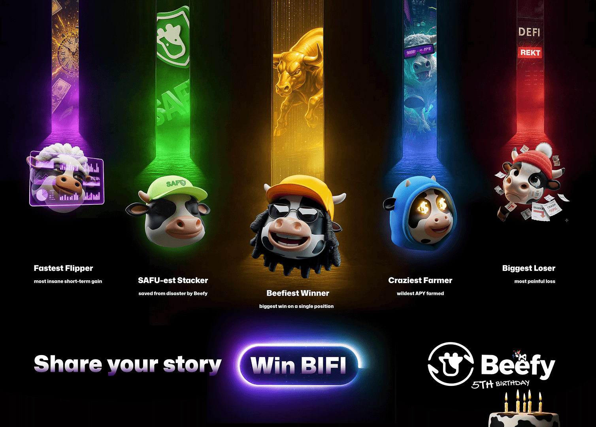
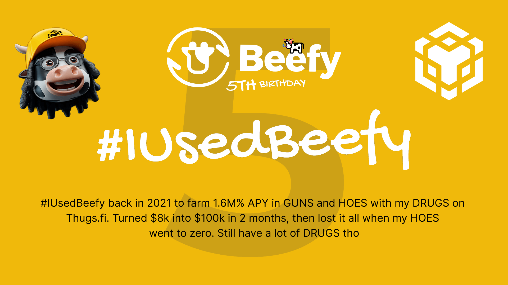

*Billions Autocompounded. Fortunes Made & Saved. An Unbeatable Product.*

This month marks Beefy’s 5th anniversary. In that time, we’ve autocompounded billions of dollars, launched thousands of products, and navigated hundreds of potential vulnerabilities — all without suffering a single hack.

Beefy stands as one of DeFi’s truly iconic and original projects, known for reimagining finance with its distinctive blend of sophisticated automation and unapologetic degeneracy. We’ve come a long way over the past five years — and there’s so much to be proud of.

To celebrate, this article recaps our journey so far and the milestones we’ve reached along the way. It also outlines how we plan to mark this incredible occasion 👀.

Without further ado, let’s take a walk down memory lane…

### Creation

Beefy was born in September 2020, conceived by five friends from northern Argentina: Sirbeefalot, 0xbeefy, roastby, superbeefyboy, and elcarno. The premise — laid out in the [original blog post](https://medium.com/beefyfinance/introducing-beefy-finance-yield-optimizer-on-binance-smart-chain-52cc6aaf1814) — was simple yet powerful: use lower-cost blockchains and onchain automation to maximise returns while minimising costs and labour. As future TVL would soon show, it was a billion-dollar idea.

In October, the protocol and $BIFI token launched with a major liquidity-mining campaign. Ninety percent of the token supply was distributed within 60 days across six pools. This fair launch ensured Beefy became a true DAO — primarily owned and governed by its community within just weeks.

The concept caught on fast. Beefy’s automated harvesting system, powered by the Cowllector bot, showcased how auto-compounding could dramatically accelerate yield growth. Combined with low gas costs on BNB Chain, Polygon, Avalanche and HECO, and a booming DeFi ecosystem, Beefy’s set-it-and-forget-it vaults delivered countless memorable opportunities.

By early 2021, Beefy had reached $10 million TVL. A month later, it surpassed $100 million, and by October 2021 — just one year post-launch — hit $1 billion locked.

Meanwhile, the $BIFI token’s price swung widely, with market valuations between $50 million and $250 million. The community expanded rapidly as contributors joined to build, moderate and grow the project — while early believers saw their conviction rewarded.

### Next Generation

With Beefy’s meteoric rise came an influx of cowmoonity members, users and tokenholders eager to help push the project forward. The contributor base multiplied, soon including a dozen developers and dozens more moderators, designers and support heroes. Beefy had become fully capable of standing on its own four hooves.

As the community grew, the founding team’s involvement naturally shifted. Having achieved their early goals, some founders moved on to other pursuits, while others stayed engaged part-time. By mid-2021, Beefy had clearly evolved into a community-led project.

In November 2021, contributors proposed a new core contributor team to establish clear responsibilities and compensation. The proposal — led by Weso — ushered in a more structured era of ongoing operations.

With improved organisation, the team soon achieved its next major milestone: the launch of Beefy V2. Since inception, Beefy had run on a fun, straightforward interface. But by late 2021, with hundreds of products across nearly a dozen chains, scalability demanded an upgrade.

The V2 project — led by Pablo — delivered a sleek dark theme and a smoother experience capable of juggling thousands of vaults across dozens of chains. After months of iterative testing, V2 officially went live in March 2022, marking the start of a new era for Beefy.

### Iteration & Innovation

From 2022 onward, Beefy entered a phase defined by relentless iteration and pragmatic innovation — deploy early, ship fast, partner widely, follow the incentives.

The team rode the DeFi waves — from the Fantom boom in early 2022 to the rise of rollups on Optimism, Arbitrum and Base in the following years. As new generations of DEX technology evolved from Curve to Solidly to Aerodrome, Beefy capitalised on high-emission environments and incentive-rich opportunities to capture substantial TVL.

Activity across chains like Canto, Kava and Linea, alongside legacy mainstays like BNB Chain, Polygon PoS and Avalanche, ensured a diversified income stream and continuous experimentation. While not every chain became a long-term giant, each taught valuable lessons and expanded Beefy’s reach.

Business development flourished too. Strategic partnerships and boosted incentive campaigns brought long-term collaborators such as Lido, while grants from Optimism Foundation and Arbitrum DAO provided hundreds of thousands of dollars in user rewards.

Behind the scenes, Beefy kept innovating. The team integrated bridging, derivatives, lending and DEX protocols into increasingly advanced yield strategies. Ease-of-use tools like our zap contracts simplified access to vaults in a single click.

The user experience improved continuously through initiatives like the Data Barn, offering full historical analytics and treasury dashboards. New features like onramping and bridging integrations transformed Beefy into a true one-stop DeFi platform, while constant UI refinements enhanced product discovery and safety.

### Migration

By mid-2023, Beefy was within striking distance of overtaking Yearn as the largest yield optimiser in DeFi. The climb seemed inevitable — until disaster struck.

Multichain, the bridging protocol that powered Beefy’s expansion across chains, collapsed when its founder was detained and the team could no longer operate. This left Beefy in a critical position: bridged assets were now at risk, and thousands of user positions had to be secured or migrated.

Over a three-month period, the team executed a complex, 15,000-position migration flawlessly — with zero funds lost. New architecture allowed Beefy to operate across multiple bridge providers simultaneously, ensuring no single point of failure in the future.

Though it wasn’t a major revenue event, the migration demonstrated Beefy’s resilience and technical excellence under immense pressure. It reminded the community — and the industry — what Beefy does best: build safe, reliable, automated systems that never miss a beat.

Emboldened, the team moved on to its next big challenge: concentrated liquidity. After six months of hard work, the Beefy Cowcentrated Liquidity Manager (CLM) launched in April 2024, delivering significantly higher yields through active management.

To fuel adoption, Beefy secured 600,000 ARB in funding from Arbitrum DAO for a three-month campaign. By year-end, CLM vaults held $70 million TVL, and Beefy had finally surpassed Yearn — becoming the largest yield optimisation protocol in DeFi.

### Celebration

Five years later, it’s remarkable to see how far both Beefy and DeFi have come. Through bull markets and bear markets alike, we’ve evolved into a more resilient, scalable, and user-centric protocol — one built to last.

To celebrate our 5th birthday, we’re running a special community campaign throughout October, spotlighting your best stories from the past five years. Winners will earn eternal glory in the Beefy Hall Of Fame across the following categories:

-   **Beefiest Winner** – biggest win on a single position
-   **Biggest Loser** – most painful loss
-   **Craziest Farmer** – wildest APY farmed
-   **SAFU-est Stacker** – saved from disaster by Beefy
-   **Fastest Flipper** – most insane short-term gain
    
To enter, simply share your story on X using the hashtag #IUsedBeefy. You can enter multiple categories, as many times as you like, with no length limits. And, for those with a talent for design, we’ve produced a [creator pack](https://www.figma.com/design/cEsGe191CezZEGWZJtUgKP/Beefy-5-creator-pack?node-id=0-1&t=5BHXRSuAzRtxLH2G-1) with visual elements to take your stories to the next level.

Our contributor team will review all entries and select winners based on wit, creativity and storytelling — not just raw numbers. We want to celebrate the fun, chaotic and human side of DeFi.

Each of the five winners will receive 1 BIFI token from the contributor team’s discretionary budget. Participants will also have the chance to claim commemorative POAPs for joining the celebration.

Want to remember the occasion forever? We’ve also released a couple of limited-edition t-shirts with a [5th birthday celebration logo](https://beefygear.creator-spring.com/listing/beefy-5th-birthday), and the [full herd birthday party](https://beefygear.creator-spring.com/listing/5th-birthday-2025?product=389). Both are available now on the [Beefy merch store](https://beefygear.creator-spring.com/).

The 5th Birthday campaign runs until 11 October. We can’t wait to hear your stories — and to celebrate five unforgettable years of Beefy 🐮🚀

[Creator Pack](https://www.figma.com/design/cEsGe191CezZEGWZJtUgKP/Beefy-5-creator-pack?node-id=0-1&t=5BHXRSuAzRtxLH2G-1) | [5th Bday Logo T-shirt](https://beefygear.creator-spring.com/listing/beefy-5th-birthday) | [5th Bday Party T-shirt](https://beefygear.creator-spring.com/listing/5th-birthday-2025?product=389)
