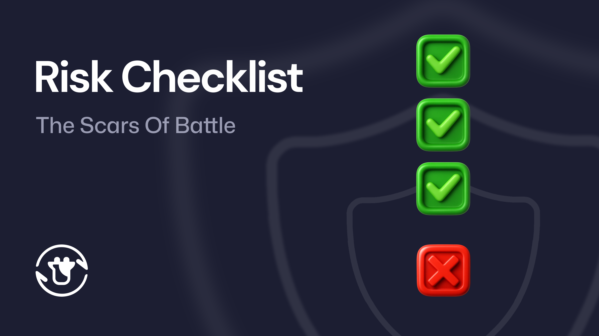
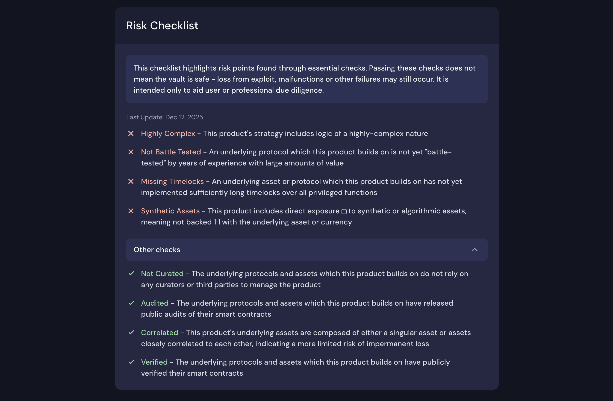
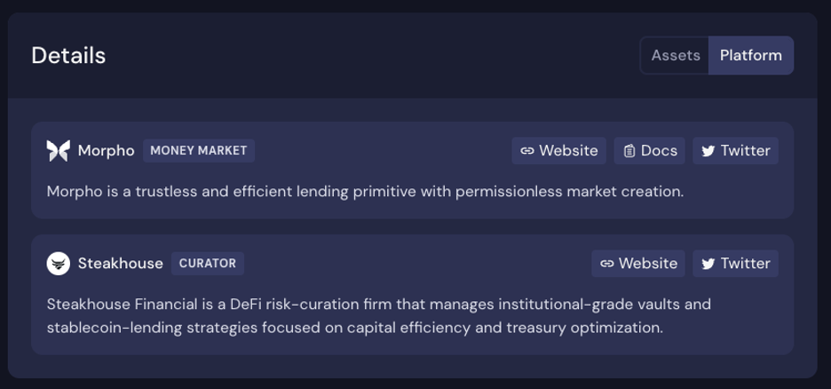

On 4 November, a miniscule rounding-error bug in the 4-year old codebase of Balancer V2 allowed \~$128 million dollars to be drained from the protocol’s users. Within hours, Stream Finance disclosed a separate \~$93 million loss from offchain accounts, leading to a depeg in the price of xUSD and questions about the backing of the Stream protocol.

Together, these events caused a liquidity cascade across DeFi, impacting a series of protocols like Euler, Morpho, Silo, Gearbox, Elixir and Beefy. Though far from the largest exploit in history, the shockwaves extended far and wide, causing many to criticise the industry’s market structure and fear contagion risks.

After over a month of post-mortem reviews and investigation, most impacted users are still suffering with significant holes in their account balances. Though some initial successes in recovery are beginning to bear fruit, the reality is that these recovery processes are often drawn-out and expensive, leaving users in an unhappy state of limbo.

For Beefy’s part, we have always sought to be forward-thinking about risk management, careful in our integrations, and clear in how we advertise risk on our platform. However, whilst we comfortably survived this stress test, the impact these events have had on our users has exposed some clear areas where we must still improve. It is only through the suffering and treatment of battle scars that Beefy can demonstrably prove that it is tried and tested.

This article takes a moment to pause and reflect on the lessons of the last month, and to articulate a selection of changes we are now undertaking to help grow and improve our protocol. For long-time DAO members, it’s a reminder that — when it comes to security — our work is never done.

## The Value Of Feedback

In the aftermath of the crash, we were gifted a significant amount of feedback and user behaviour data. When carefully considered and delivered, clear feedback offers a meaningful opportunity to help improve our performance. This was an opportunity we were keen to seize.

One of the most important pieces of feedback we received from users was their frustrations with a false sense of security. These users had relied on our app’s Safety Score module as a core part of their due diligence, and were surprised to learn later about the nature of the assets that the underlying protocols introduced exposure to. Several confessed to interpreting the list of green-marked checks as *“all good”*, leading them to refrain from any further diligence work. Clearly, both sides need to do better.

From feedback about the kind of checks that were performed, we’ve learned that common gaps in due diligence were caused by a variety of factors — some avoidable and some not. Users couldn’t reasonably have discovered a longstanding gap in Stream’s offchain accounts through any reasonable amount of diligence; that was simply unavoidable, and only apparent in retrospect. However, the level of exposure to Stream’s xUSD was apparent from onchain data. The surprise about these levels of exposure shows clearly that more should be done to educate users about the nature of curated products.

Separately, we also faced a good number of questions about the nature of coverage products issued in relation to affected Balancer products, and how they operate in these circumstances. We were pleased to see users who had previously acquired coverage come forward and succeed in claiming compensation from providers like Nexus Mutual and OpenCover. However, we were also faced with a broader call to action: couldn’t Beefy just integrate coverage into the protocol?

Through these valuable insights, we are now proposing a range of changes to better prepare Beefy for similar events in the future.

## From Safety To Risk

With respect to our Safety Score module, we appreciate that the customer’s experience — whether intended or not — should guide our application development. Even if only a slim minority of customers were leaning on the module to arrive at a false sense of security, we still must question whether this feature is really still fit for purpose.

Today, we introduce a new Risk Checklist module, which will replace the Safety Score moving forward. The new module aims to put risks at the forefront of users’ minds, and avoid any false sense of security. It places the emphasis on identifying and managing risk points, rather than reaching any sense of safety.

The Risk Checklist has several core components:

* A new introduction emphasises that the list is limited to essential checks and as an aid to due diligence, not a comprehensive statement of safety.  
* A *“Last Updated”* sub-header gives a sense of how recently the last changes were made. The longer the gap in time since the last update, the more careful the user needs to be with the checklist whilst performing their own due diligence.  
* The default checklist contains risks only, marked clearly in red and with text that is tailored only for risks (rather than the same text whether the check is passed or failed).  
* A dropdown list at the bottom expands to the other standard checks performed on the product. Here, the user can see the checks that passed marked clearly in green, again with tailored language. However, these affirmative confirmations are not visible to the user by default, so they must first engage with the module to see this positive feedback.

Within the checklist, we now emphasise 8 different essential checks that help us to understand the risk profile of each Beefy product:

1. **Audited** \- the protocols and underlying assets that a Beefy product builds upon should have full public audits of their material, value-holding smart contracts.  
2. **Verified** \- the protocols and underlying assets that a Beefy product builds upon should have verified their smart contracts for public review on at least one major blockchain explorer.  
3. **Timelocked** \- the protocols and underlying assets that a Beefy product builds upon should have implemented timelocks around any privileged functions that could take or harm user funds.  
4. **Battle-tested** \- the protocols that a Beefy product builds upon should have been live for over a year and handled a significant amount of funds without issue to be classed as battle-tested.  
5. **Complex** \- the Beefy product’s strategy should be considered risky if it involves logic of a highly-complex or novel nature, including in underlying protocols or assets.  
6. **Correlated** \- a risk of impermanent loss should be considered if the assets underlying a Beefy product are not obviously correlated to one another.  
7. **Curated** \- risks associated with the management of underlying protocols and assets should be considered where a Beefy product builds upon products that are curated or managed by external third parties.  
8. **Synthetic Assets** \- risks should be raised considered for any assets that are not verifiably and redeemably backed 1:1 with the underlying asset.

To implement the new checklist, we have also conducted a comprehensive review of our live products, updating any risk parameters where appropriate. With additional guidance on the new risk parameters, all new products will be deployed with this risk formulation in mind.

Together, we hope this raft of changes will improve the user experience when reviewing the risk profile of our products. Our primary aim here is to reduce the number of frustrated expectations where our products suffer from unexpected-but-forseeable issues.

## Clarifying Curation

Another key learning from this experience is that curation needs more care, both from Beefy and our users.

At the heart of this problem is a misalignment of expectations: strategists were comfortable introducing a Beefy product to compound additional rewards paid on curated products without accepting any control over the different exposures from the curated assets; users — by contrast — were disappointed to realise that Beefy does not actively curate these exposure, nor does it replicate the job of curators in performing comprehensive due diligence over every asset, protocol and oracle used. Instead, Beefy performs its standard due-diligence checks on launch and significant changes, but otherwise leaves the management of exposure to each curator.

Bringing these two perspectives together, it’s clear that curated products are a different breed to our typical vaults and CLMs. We therefore need to strive towards a compromise of more information on the application with adjusted expectations as to what is being performed. Beefy is not a curator, and does not assume the responsibility of selecting exposures for the user. But more information can and should be given.

In addition to adding a dedicated curation item to our new Risk Checklist module, we have also introduced a range of other informational updates to the Beefy web app:

* Added a link to the *“Underlying platform”* in the Strategy module, so that users can easily view the underlying curated product on the base platform.  
* Incorporated the curator name to the product title on the Beefy app, allowing users to easily search by curator or identify which curator they are entrusted to manage their exposure.  
* Included curator details in the *“Platform”* tab of the Details module, allowing users to quickly navigate to the curator’s website and socials for more information.

Though curation is still a tricky topic, and one that requires careful consideration by both Beefy and our users, we hope that these initial changes will help to clarify the position for unfamiliar users, as well as providing an easier experience for users looking to evaluate these products.

## Protocol Coverage

Finally, in response to requests for Beefy to offer more coverage options, we have sounded out the idea of introducing protocol coverage in partnership with Nexus Mutual.

Today, we are releasing the draft [\[BSP:04\]](https://docs.google.com/document/d/1hr8IDdf87KRFflmT3lR_-S4PNN5ckVvMh0eNV9WgSk0/edit?usp=sharing) — a steering proposal on the topic of a protocol coverage fund, aimed at gauging the DAO’s response to seriously pursuing the idea of native coverage within the protocol.

It explores to what extent coverage is possible, how a partial-coverage mechanism could work, the cost components of such policies, and potential funding avenues should the DAO wish to pursue protocol coverage. 

Our proposal is light on specifics, and instead intended to bring the DAO into these discussions. We wish to make holders aware of the likely costs and components of an in-built coverage mechanism, and flag that coverage would necessarily be expensive, a fraction of total value locked in the protocol, and limited to only a selection of underlying protocols. 

With that said, the steering proposal does introduce a viable solution to ensure that users would receive a significant proportion of their deposits back in circumstances similar to the Balancer V2 exploit.

Ultimately, the purpose of this proposal is to ignite discussion and gauge reaction, before continuing on to negotiate specifics and present a complete proposal to the DAO. We want your help to assess the value that protocol coverage could offer to users, and whether our tokenholders agree that this is a smart investment.

For interested readers, we have published the details in our \#proposal-discussions channel on the Beefy Discord server. We would be delighted to hear your feedback, and ideas for how protocol coverage might work in practice.

## Improving

Large, systemic shocks like those suffered in November are painful. Seeing innocent users stuck waiting to recover lost funds can be heartbreaking. But testing and better understanding our weaknesses is helping Beefy to improve.

Over the last month, Beefy’s contributor team has been galvanized in pursuit of updates and improvements. With the selection of changes highlighted in this article, we hope to deliver a meaningful upgrade to our application and protocol that will better prepare us for similar situations in the future.

At their heart sits the feedback of our users and community. We hope these ideas are compelling for you and a meaningful change. However, ultimately we want to hear from you about how to make Beefy better and more effective in these circumstances. 

Together, we can ensure that Beefy is and remains the protocol that you need to make DeFi easy for you.