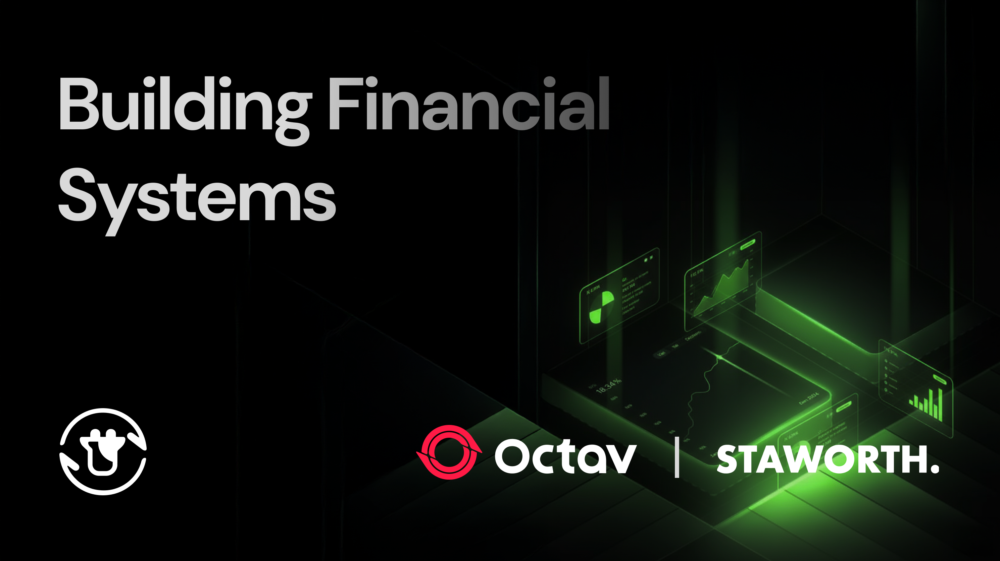
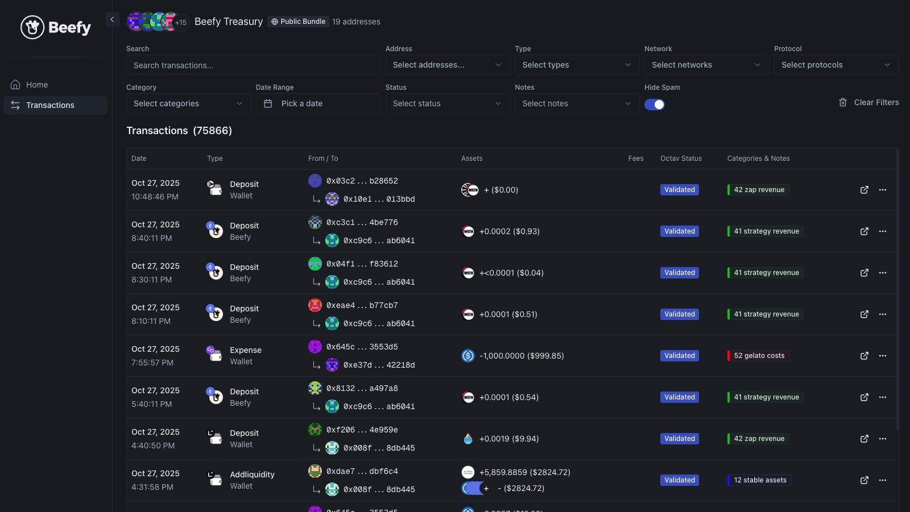

The promise of DeFi is a financial revolution. Programmable money; transparent transactions; trustless systems. 

Yet 2025 still saw too many instances of backward practices by unscrupulous asset managers and monopolistic corporations. In 2026, we think the world deserves better.

It's for these reasons that Beefy continues to push forward with innovation around our financial management and transparency. Together with valued partners like Octav, we're building systems that deliver users live insights into our performance, complete access to our data, and accurate, forthright reporting on our activities.

This article recaps the work undertaken by Beefy, Staworth and Octav in 2025 to level up our financial reporting and treasury management, and how Beefy is helping to demonstrate the promise of DeFi.

## Octav

In January 2025, Beefy signed a 12-month deal with Octav, a leading provider of portfolio intelligence data across a wide range of blockchains, digital assets, and DeFi protocols. They brought broader coverage at lower cost—and the willingness to integrate deeply with Beefy’s own systems.

We chose Octav as much for their mentality as their technology. Many providers still act like traditional SaaS companies: ship a fixed product and reserve influence for the biggest clients. Octav is built by DeFi operators who understand the grind of reconciling thousands of transactions. They're building new solutions around real client needs instead of forcing a one‑size‑fits‑all product.

It's proved to be an excellent partnership...

## Data Management

The first problem Octav helped Beefy solve was automated pricing and categorisation of transaction data. Our treasury multisigs have over 75,000 lifetime transactions, with more than 21,000 in 2025 alone, and accurate accounting can take hundreds of hours.

Previous providers had frequent pricing gaps and limited rule design, which restricted our ability to automate categorisation. Octav rebuilt custom rule logic from the ground up to meet our toughest categorisation challenges, and their platform aggregates data from CoinGecko, DefiLlama, DeBank, and their own sources, letting users choose which sources they prefer. Today, 90–95% of Beefy’s transactions are categorised and priced automatically in production.

This saves significant time and improves analytics and monitoring of live income and costs. For example, revenue from our Zap contracts can involve hundreds of tokens and thousands of transactions; 99% are now processed automatically and accurately, giving us comprehensive live performance stats without waiting for end‑of‑quarter reviews.

And we’re not stopping there. Beefy has always aimed for transparency, publishing multisig activity live on Discord. In the same spirit, Octav has opened our [transaction data](https://beefy.octav.fi/app/transactions) to the public so anyone can browse our full transaction history and see our categorisation and notes.

## Self-serve Data

Beyond merely displaying our data publicly, Octav has structured its application design to be API-native; or in other words, to prioritise self-serve data. This aligns with the broader ethos of DeFi and open-source technology: they're building [a bustling bazaar, not a closed cathedral](https://en.wikipedia.org/wiki/The_Cathedral_and_the_Bazaar).

Octav's [powerful API](https://docs.octav.fi/api/introduction) provides a selection of endpoints and configuration options, allowing its users to carefully select the data they want to access, and run efficient processes to get what they need. With rapidly-growing capabilities, Octav is embracing clients who want their data but don't need another application to use it.

For Beefy, this allows us to pass on the benefits of this self-service directly to our community. The most obvious channel for this is the Beefy Discord server, where so many of our loyal, long-term users bring questions and discussion points for open debate. By integrating access to Beefy's data via the Octav API, we were able to deploy a simple bot for users to access this data. Through a range of commands, they can receive aggregate statistics and live data on our treasury activities from anywhere within our Discord server.

The Octav Bot is now live and free to use on the Beefy Discord server. The codebase is being actively maintained, with a range of features already on offer. Feature requests and feedback will be gladly received on Discord.

## A Hub For Our Finances

The culmination of these efforts is our new [Financial Hub](https://beefy.staworth.com), a one-stop shop for data and analytics on Beefy's financial performance. 

Built on top of the Octav API, the Hub extends Octav's existing functionality, allowing [custom dashboards](https://beefy.staworth.com/dashboard) to represent Beefy's specific operational characteristics and needs, as well as [detailed reports](https://beefy.staworth.com/reports) showing our balance sheet, income statements and performance against governance proposals. Where previously this data was provided piecemeal across a range of distribution channels, now it sits altogether in a single live and continuous application.

Perhaps the most powerful feature of the Hub is an extension of the Discord bot's self-serve data facility. The Hub's [Query page](https://beefy.staworth.com/query) empowers users to not only extract data but to build charts of their own design by filtering Beefy's data on Octav. With [5 initial chart types](https://beefy.staworth.com/widget) provided, the possibilities are truly endless for the types of analysis that can be generated through the Hub.

When brought together, this selection of features empowers Beefy's tokenholders, users and prospective investors to closely follow our financial performance, and inspect our data to answer their own questions and perform their own analysis.

For a detailed deep dive of building on the Octav stack, read Staworth's article on [Building Financial Systems](https://staworth.com/articles/beefy-octav-financial-hub).

## Another Year

In a world empowered by blockchains, a complete degree of financial transparency becomes possible for all manner of organisations. If capitalised on, this can close the information gap and empower our economies to make better decisions. We at Beefy are proud to be one of the foremost DeFi organisations pushing this dream forwards into reality. 

2025 was a breakout year for Beefy’s accounting and financial reporting, as well as for Octav’s platform and tech stack. But much of this progress sought to lay the foundations. In 2026, we look forward to pushing boundaries and building user-led functionality. 

We hope you'll join us for the journey.

[Beefy Transaction Data](https://beefy.octav.fi/app/transactions) | [Beefy Financial Hub](https://beefy.staworth.com) | [Staworth Article](https://staworth.com/articles/beefy-octav-financial-hub)
